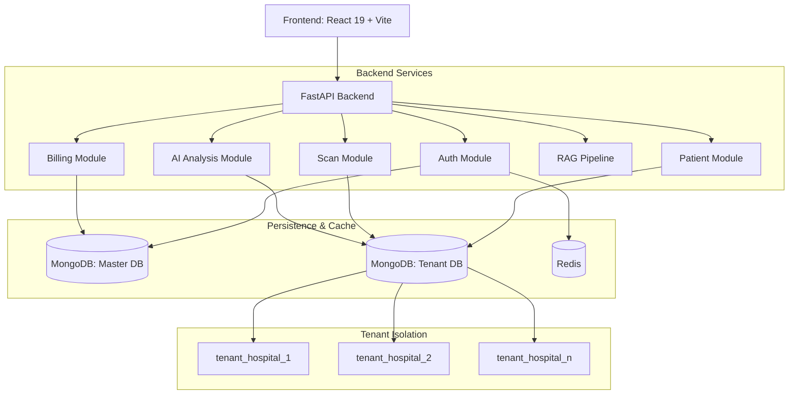

# AI X-Ray Analyzer

> Multi-tenant SaaS platform for AI-powered chest X-ray diagnostics. Each hospital operates in a fully isolated environment with its own database, staff, and patient records.

---

## Overview

AI X-Ray Analyzer enables hospitals to upload chest X-ray images and receive instant AI-driven diagnostic predictions with visual explanations (Grad-CAM heatmaps). The platform is built as a multi-tenant system where every hospital gets complete data isolation — separate databases, independent user management, and per-tenant usage controls.

---

## Key Features

- **Database-per-tenant isolation** — each hospital's data lives in its own MongoDB instance
- **AI-powered analysis** — deep learning model with Grad-CAM visual explanations
- **WebAuthn passkey authentication** — biometric login (FaceID, TouchID, fingerprint)
- **Role-based access control** — Doctor, Hospital Admin, Super Admin
- **Invite-code onboarding** — admins generate codes, doctors join instantly
- **Usage metering** — scan limits, user seats, and plan management per hospital
- **Audit logging** — every authenticated request is logged with tenant context

---

## Architecture



---

## Tech Stack

- **Backend:** FastAPI (Python 3.11)
- **Database:** MongoDB with Motor (async driver)
- **Cache:** Redis
- **Auth:** JWT + bcrypt + WebAuthn/FIDO2 + Email OTP
- **Frontend:** React 19, Vite, Tailwind CSS 4
- **Containerization:** Docker Compose

---

## Project Structure

```
├── backend/
│   ├── core/           Database, auth, middleware, config
│   ├── routes/         API endpoints (domain-based modules)
│   ├── services/       Shared services (email)
│   ├── scripts/        CLI utilities
│   ├── templates/      Email templates
│   ├── main.py         Application factory
│   ├── Dockerfile
│   └── docker-compose.yml
│
├── frontend/
│   ├── src/
│   │   ├── api/        API client modules
│   │   ├── components/ Reusable UI components
│   │   ├── context/    Global state (auth)
│   │   └── pages/      Route-level page components
│   ├── index.html
│   └── package.json
│
├── .github/            CI workflow + PR template
├── .manuals/           Project documentation
├── CONTRIBUTING.md     Team workflow guide
└── LICENSE             MIT
```

---

## Contributing

See [CONTRIBUTING.md](CONTRIBUTING.md) for branch naming, commit conventions, and the pull request workflow.

---

## License

This project is licensed under the [MIT License](LICENSE).
